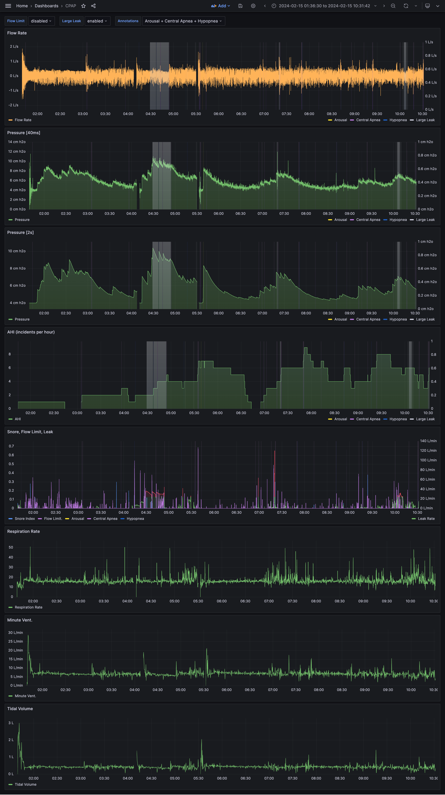
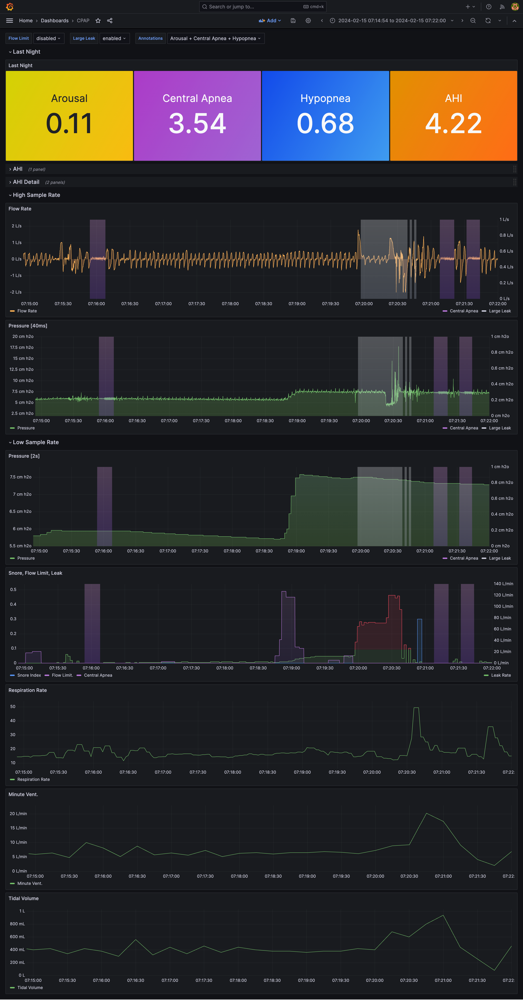

# edf-importer
Tool to import .edf files to influxdb or victoriametrics.
I created this tool to import data from my ResMed AirSense 11 AutoSet CPAP machine into VictoriaMetrics.
It may not necessarily correctly import data from other models or brands yet. 
It does support both timeseries metrics and annotations (events).

## Caveats
- The path is expected to be a directory filled with datestamped dirs in `YYYYmmdd` format.
- The filenames to read are currently requiring to end in BRP.edf, EVE.edf, or PLD.edf.
- EDF / CPAP data is usually sampled at a very high rate. Make sure your database is configured
to allow this. For Victoriametrics, for example, make sure the flag `-dedup.minScrapeInterval` is
set to a low value, in my case less than 40ms.
- The data is read with your computer's local timezone, as EDF files do not necessarily have a timezone
associated with their data.
- Zero-duration events from EDF+ annotations are automatically given a 10 second duration.
This was done to allow easier graphing of ResMed Hypopnea events.

## Running

Copy `edf-importer.example.yaml` to `edf-importer.yaml` and fill in your database config.

Edf-importer will continue to run and watch the specified path, importing new data the next time
you insert your SD card.

    ./edf-importer --config edf-importer.yaml --path /Volumes/<drivename>/folder    

    Usage of ./edf-importer:
      -config string
        	Config file (default "edf-importer.yaml")
      -dry-run
        	Don't insert into the database
      -path string
        	Path to data directory (default "/Volumes/NO NAME/DATALOG")
      -state-file string
        	State file (default "edf-importer.state.yaml")
      -v	Show version and exit

## Running as a macOS LaunchAgent

- Create a directory for edf-importer to live in. I chose `/Users/me/Documents/edf-importer`.
- Copy to the directory:
  - The `edf-importer` binary
  - Download `edf-importer.example.yaml`, rename to `edf-importer.yaml` and fill in your values
  - Download `com.github.tedpearson.edf-importer.plist.example`, rename to 
  `com.github.tedpearson.edf-importer.plist`, and modify the paths to point to the directory
  you chose above, and change the `--path` argument to point to your SD card volume.
  - Move `com.github.tedpearson.edf-importer.plist` to `~/Library/LaunchAgents`
  - Start edf-importer with `launchctl bootstrap gui/$(id -u) ~/Library/LaunchAgents/com.github.tedpearson.edf-importer.plist`

## Details

Info about exported data:

Metric name: **cpap**
- fields:
  - "edf supplied name"
    - name will be whatever the EDF label name is from the EDF file.
    - contains the raw data from the EDF file
  - annotation
    - value of 1 during the event
    - value of 0 before and after the event
- tags
  - event
    - contains the EDF+ annotation name
    - only on annotation events, not raw data

## Dashboard

I have included my [Grafana dashboard definition](dashboard/dashboard.json) in the repo.
I based it heavily on the graphs in OSCAR (see [Other Resources](#other-resources)).

Here are a couple screenshots of the dashboards, one of an entire night, and one zoomed
in so you can really see the details of the annotations and individual breaths.

Features:
- Has annotation/events, large leak, and flow limit color block display, which are toggleable
- Has graphs of Flow Rate, Pressure, AHI, Snore Index, Flow Limit index, Leak Rate,
  Respiration Rate, Minute Ventilation, and Tidal Volume.

### Dashboard - Full Night

### Dashboard - Zoomed

## Other Resources

Edf-importer was heavily influence by and my dashboards were inspired by
[OSCAR, the Open Source CPAP Analysis Reporter](https://www.sleepfiles.com/OSCAR/).
OSCAR allows you to import and view all the same data, see overviews and summary reports,
and also has some additional calculated metrics including inpiration time, expiration time, and
time at pressure. I will note that its AHI graph resets every time there is a data gap (when
you take off the mask), so my dashboard is more accurate in this one case.

For many people, OSCAR is probably all you need. For the nerds, this project is for you.